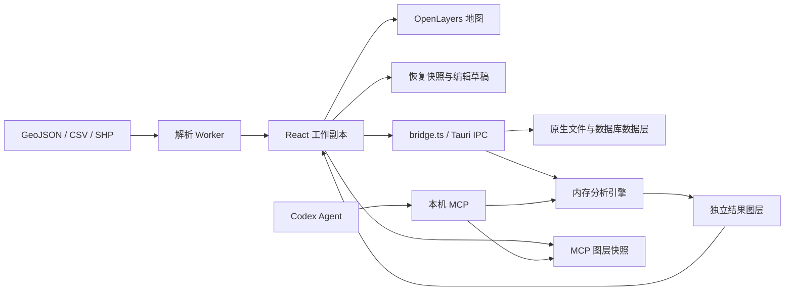

# 代码结构与维护边界

zGIS 是 Tauri 2 桌面应用。React 保存编辑工作副本，OpenLayers 展示工作几何，Rust 负责原生文件、持久化、数据库会话、空间分析与本机 MCP。所有工作几何统一为 WGS84，来源 CRS 单独保存。

## 模块入口

| 模块 | 主要文件 | 职责与边界 |
| --- | --- | --- |
| 工作区与编辑协调 | `src/App.tsx`、`workspace.ts`、`dbChanges.ts`、`attributeEditing.ts` | 图层、选择、编辑会话、历史、恢复与提交；源文件保存由显式操作触发 |
| 地图 | `src/MapView.tsx`、`mapEditing.ts`、`mapLayerSync.ts` | 工作几何到地图投影、绘制、移动、顶点编辑、选择样式；属性与数据库基线仍由领域模型持有 |
| 文件解析 | `src/workers/`、`src/domain/` | 浏览器与 WebView2 的 Worker 解析、字段与 CRS 校验；取消和传输异常释放 Worker |
| 页面与设置 | `LayerTreePanel.tsx`、`FilePanels.tsx`、`DatabasePanels.tsx`、`PostgisManager.tsx`、`SettingsPage.tsx` | 操作入口与局部草稿；原生协议统一经 `bridge.ts` |
| 原生文件与恢复 | `src-tauri/src/lib.rs`、`preferences.rs` | 注册文件句柄、指纹检查、原子保存、恢复副本、DPAPI 配置 |
| 数据库 | `lib.rs`、`postgis_catalog.rs`、`mysql_catalog.rs`、`database_passwords.rs` | 每连接串行、不同连接隔离；查询限制、完整基线、事务与不确定提交保护 |
| 矢量与分析 | `vector_files.rs`、`shapefile_export.rs`、`spatial.rs`、`processing.rs` | 外部矢量读取、格式保真边界、内存分析及输出预算 |
| MCP 与 Agent | `gis_mcp.rs`、`mcp_credentials.rs`、`codex_agent.rs` | 本机认证、快照、分析缓存、结果发布及所属 Agent 进程生命周期；不直连数据库 |
| 产品与网络信息 | `app_info.rs`、`basemap_preview.rs` | 固定项目链接、版本比较、受限图片预览请求 |
| 交付 | `scripts/build.ps1`、`install.ps1`、`.github/workflows/` | 锁文件构建、版本门禁、包外安装验证、标签发布与校验文件 |

## 数据流

数据库身份和提交基线不能进入恢复快照；恢复后的数据库图层是本地副本。原生文件覆盖必须检查来源指纹，SHP 输出不得覆盖原文件组。MCP 发布结果只加入未保存图层，不替用户保存来源或提交数据库。

## 性能维护原则

- 地图内容同步与选择状态同步分开；同样式的要素复用 OpenLayers Style，批量添加要素构建空间索引。
- 属性字段、搜索、选中记录等全量计算按实际依赖缓存，避免鼠标坐标和无关面板状态触发重新扫描。
- Worker 输入使用紧凑、可转移的独立缓冲区，调用方保留原文件供重试；完成、取消和异常都终止 Worker。
- 数据库目录锁只用于获取连接；耗时 I/O 使用每连接锁。排队和查询均有超时，断开后排队请求不能继续使用已移除的连接。
- 面关系和叠加先排除包围盒不相交的候选；仍保留精确几何计算、输入规模及要素对数限制。
- JSON 大小检查使用有界计数写入，避免为了检查再创建完整字符串。输入与结果限制仍是保护边界，不代表任意上限规模均流畅。

## 仍需逐步处理的技术债

`App.tsx` 集中了编辑协调、弹窗和持久化；`lib.rs` 同时拥有原生文件与 PostGIS 命令。后续可按工作区持久化、编辑会话、文件服务和连接注册表逐步拆分，迁移时先保留现有 IPC 和回归测试。一次性拆分会扩大回归范围，不纳入 0.2.0。

前端主入口仍约 1.34 MB（压缩前）的构建块，恢复快照仍需在主线程序列化。后续可按设置、数据库与分析页面逐步延迟加载，并评估快照增量持久化；本版先减少重复工作，未改变恢复日志协议。

空间分析仍基于内存与局部平面计算，包围盒筛选没有替代数据库空间索引或测地算法。大量重叠面、复杂多部件、高密度顶点仍受既有预算限制。数据库读取仍有条数上限，没有服务端游标分页。

测试覆盖应用数据层的纯逻辑与夹具，不构成真实 PostGIS/MySQL 的 TLS、DDL、约束及并发集成证据；这些验证必须使用明确指定的测试环境。

完整命令见 [README](../README.md)，协议见 [IPC](../src-tauri/IPC.md)，安装与发布见 [发布说明](release.md)。
